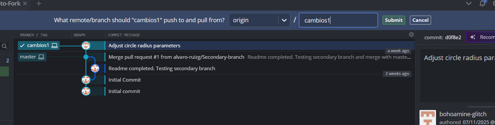

1.Crea un repositorio vacío en tu cuenta con la interfaz web de GitHub :
--He creado un repositoen mi cuenta git hub .

2.Clona este repositorio en tu PC. Modifica el origen remoto para añadir tu nuevo repositorio :
--he clonado el repositorio de alvaro en git kraken.

3.Crea una nueva rama (branch) con la ayuda de la UI de GitKraken :
--he creado una rama y lo he llamado cambios1.

4.Modifica el proyecto para añadir funcionalidades. Puede servir cualquier aspecto de la jugabilidad (sistema de puntuación, calibración de la velocidad, ajustes de la interfaz, incorporación de imágenes o música).
--he hecho unos modificaciones en la rama cambios1.

5.Realiza al menos un commit y un push a esta branch.
--he hecho un commit y un push a la rama cambios1.

6.Fusiona los cambios en tu rama secundaria con tu rama principal.
